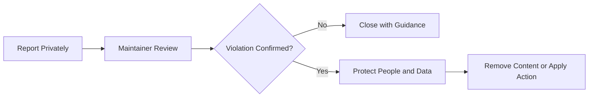

  
  
  
  
  

<h1 align="center">Code of Conduct</h1>

  <strong>Respect people. Protect HR data. Discuss evidence. Improve the project.</strong>

  <a href="#-our-commitment">Commitment</a> ·
  <a href="#-expected-behaviour">Expected Behaviour</a> ·
  <a href="#-unacceptable-behaviour">Unacceptable Behaviour</a> ·
  <a href="#-hr-data-responsibility">HR Data Responsibility</a> ·
  <a href="#-reporting-and-enforcement">Reporting</a>

---

## 🤝 Our Commitment

We are committed to maintaining a **respectful, inclusive, professional and harassment-free** environment for everyone who participates in this project.

This repository combines human resources, workforce analytics, business intelligence and synthetic employee data. Contributors must treat both **people and data** with dignity, care and professional judgment.

> Contributions are evaluated on evidence, business logic, technical quality, responsible data use and constructive collaboration—not on status, background or level of experience.

### Core standards

| Principle | Required standard |
|---|---|
| **Respect** | Communicate professionally and avoid personal attacks |
| **Evidence** | Challenge ideas with specific facts, logic and reproducible findings |
| **Privacy** | Never expose confidential, personal or unauthorised HR information |
| **Accuracy** | Never present synthetic data as authentic company records |
| **Accountability** | Correct mistakes promptly and respond constructively to review |
| **Inclusion** | Support contributors with different HR and technical experience levels |

---

## ✅ Expected Behaviour

<table>
<tr>
<td width="50%" valign="top">

### Communication

- Be respectful, specific and constructive.
- Focus feedback on the contribution—not the contributor.
- Explain the business or technical reason behind requested changes.
- Allow reasonable clarification before escalating disagreements.

</td>
<td width="50%" valign="top">

### Project responsibility

- Protect privacy and confidentiality.
- Use inclusive and professional language.
- Validate analytical claims before presenting them.
- Accept responsibility and correct mistakes promptly.

</td>
</tr>
</table>

---

## 🚫 Unacceptable Behaviour

The following conduct is not permitted:

- harassment, intimidation, discrimination or personal attacks;
- hostile, insulting, threatening or dismissive communication;
- publishing private, confidential or personally identifiable employee data;
- presenting synthetic data as real organisational information;
- deliberately misleading analytics, metrics, screenshots or documentation;
- exposing passwords, tokens, connection strings or private local paths;
- spam, unrelated promotion or intentionally disruptive conduct.

> A technically correct contribution may still be rejected when it violates privacy, safety, licensing or professional-conduct requirements.

---

## 🛡️ HR Data Responsibility

All public examples and contributions must use **synthetic, anonymised or properly authorised data**.

| Do not publish | Examples |
|---|---|
| Personal identifiers | National ID, passport, personal phone, private email or home address |
| Financial information | Payroll details, bank information or individual compensation records |
| Sensitive employment data | Medical, disciplinary, performance or grievance records |
| Secrets and infrastructure | Passwords, API keys, tokens, private paths or connection strings |
| Misrepresented data | Synthetic records described as authentic company information |

When uncertain, stop the upload and use the private reporting channel before sharing the material publicly.

---

## 📬 Reporting and Enforcement

Report conduct, privacy or security concerns through the relevant private channel:

- [`SECURITY.md`](SECURITY.md) — vulnerabilities, secrets, unsafe paths or sensitive-data exposure;
- [`SUPPORT.md`](SUPPORT.md) — repository support and non-sensitive conduct guidance.

Include only the context required to review the concern. Do not repost sensitive HR or personal information in a public issue or pull request.

### Possible maintainer actions

| Situation | Possible response |
|---|---|
| Good-faith misunderstanding | Clarification, guidance or requested correction |
| Unsafe or inaccurate content | Edit, hide, reject or remove the contribution |
| Sensitive-data exposure | Restrict access, remove content and follow the security process |
| Repeated disruptive conduct | Limit participation or close related discussions |
| Serious or deliberate violation | Block participation and preserve relevant private records |

Maintainers may edit, remove or reject comments, commits, issues, pull requests or other contributions that violate this Code of Conduct.

---

## ⚖️ Fair Review Principles

- Reports are assessed consistently and without retaliation.
- Only information relevant to the review should be collected.
- Sensitive HR or personal information must not be posted publicly.
- Actions should be proportionate to seriousness, impact and recurrence.
- Good-faith mistakes should normally be handled through clarification and correction.
- Private information collected during review should remain restricted.

---

## 🌐 Scope

This Code of Conduct applies to:

- repository discussions and issues;
- pull requests and code reviews;
- documentation, datasets, dashboards and notebooks;
- project-related public communication;
- any public representation of this repository or its contributors.

---

## 📚 Attribution

This policy is informed by established open-source community standards and adapted for a Bangladesh-focused HR analytics portfolio project.
