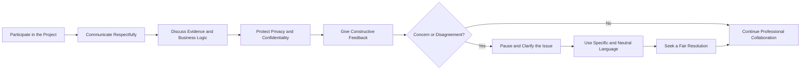
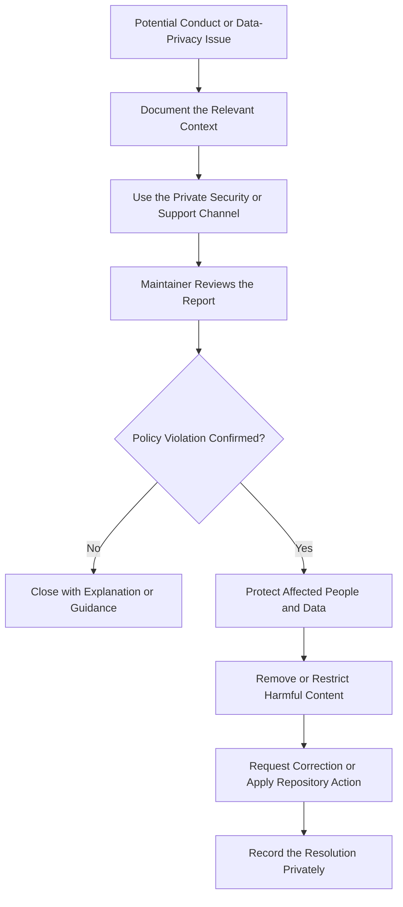

# Code of Conduct

## Our Commitment

We are committed to maintaining a respectful, inclusive, professional, and harassment-free environment for everyone who participates in this project.

This repository combines human resources, workforce analytics, business intelligence, and synthetic employee data. Contributors are expected to treat both people and data with dignity, care, and professional judgment.

## Community Conduct Model

## Expected Behaviour

Examples of positive behaviour include:

- communicating respectfully and constructively;
- giving specific, actionable feedback;
- acknowledging different levels of technical and HR experience;
- protecting privacy and confidentiality;
- using inclusive and professional language;
- focusing discussions on evidence, business logic, and project quality;
- accepting responsibility and correcting mistakes promptly.

## Unacceptable Behaviour

The following are not acceptable:

- harassment, intimidation, discrimination, or personal attacks;
- publishing private, confidential, or personally identifiable employee data;
- presenting synthetic data as real organisational information;
- deliberately misleading analytics, metrics, or documentation;
- hostile, insulting, or dismissive communication;
- spam, unrelated promotion, or disruptive conduct.

## HR Data Responsibility

All public examples and contributions must use synthetic, anonymised, or properly authorised data. Contributors must not upload payroll records, medical information, performance records, contact details, national identifiers, or other sensitive employee information.

## Reporting and Enforcement Workflow

Repository maintainers may edit, remove, or reject comments, commits, issues, pull requests, or other contributions that violate this Code of Conduct.

## Fair Review Principles

- Reports should be assessed consistently and without retaliation.
- Only relevant information should be collected during review.
- Sensitive HR or personal information should not be posted publicly.
- Actions should be proportionate to the seriousness and recurrence of the behaviour.
- Good-faith mistakes should normally be handled through clarification and correction.

## Scope

This Code of Conduct applies to repository discussions, issues, pull requests, code reviews, documentation, and any public representation of the project.

## Attribution

This policy is informed by established open-source community standards and adapted for an HR analytics portfolio project.