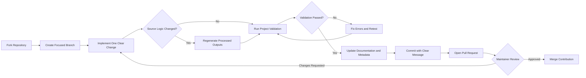
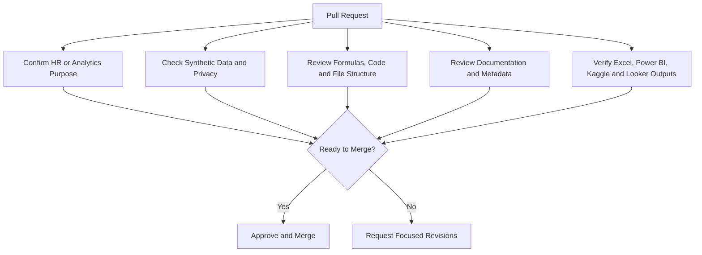

# Contributing to Hossain Group HR Turnover Analytics BD

Thank you for considering a contribution to this Bangladesh-focused HR analytics portfolio project. Contributions should improve analytical accuracy, reproducibility, documentation quality, dashboard usability, or responsible HR-data practice.

## Contribution Principles

- Keep all public data synthetic and free of personally identifiable information.
- Preserve the existing folder structure and naming conventions.
- Document changes to formulas, schemas, KPIs, or business rules.
- Prefer transparent and reproducible calculations over manual outputs.
- Validate Excel, CSV, JSON, notebook, and Power BI project assets before submission.

## Contribution Workflow



### Review Responsibilities



## Recommended Workflow

1. Fork the repository.
2. Create a focused branch:

```bash
git checkout -b feature/clear-change-name
```

3. Install the requirements:

```bash
python -m pip install -r requirements.txt
```

4. Make the change.
5. Run validation:

```bash
python scripts/validate_project.py
```

6. Regenerate processed outputs when source logic changes:

```bash
python scripts/generate_powerbi_project.py
```

7. Commit with a clear message:

```bash
git commit -m "Add department-level retention analysis"
```

8. Open a pull request with the business reason, files changed, validation result, and screenshots when dashboards are affected.

## Data and Schema Changes

When adding or modifying fields:

- update `data/metadata/data_dictionary.json`;
- update relevant documentation;
- keep dates in ISO format where practical;
- maintain stable column names across Excel, CSV, Python, Power BI, and Looker Studio;
- explain any breaking change in `CHANGELOG.md`.

## Excel Contributions

- Preserve formula-driven calculations.
- Avoid hidden hard-coded KPI results.
- Keep print and dashboard layouts readable.
- Check formulas for `#REF!`, `#DIV/0!`, `#VALUE!`, `#NAME?`, and `#N/A` errors.

## Power BI Contributions

- Preserve the `.pbip` project structure.
- Keep report and semantic-model files source-control friendly.
- Document new measures and data dependencies.
- Do not commit local cache files or `.pbix` binaries.

## Documentation Standard

Documentation should be concise, professional, and understandable to an HR practitioner with intermediate analytics knowledge. Use tables, examples, Mermaid diagrams, and commands where they add practical value.

## Pull Request Checklist

- [ ] The change has a clear HR or analytics purpose.
- [ ] No real employee or confidential data is included.
- [ ] Validation passes.
- [ ] Documentation and metadata are updated.
- [ ] Generated outputs are refreshed where necessary.
- [ ] The change does not break Excel, Power BI, Kaggle, or Looker Studio workflows.
- [ ] Mermaid diagrams render correctly when documentation is changed.

By contributing, you agree to follow the repository's `CODE_OF_CONDUCT.md` and licensing terms.