<p align="center">
  
  
  
  
</p>

<h1 align="center">📘 Dataset Usage Guide</h1>

<p align="center">
  <strong>Why, how and where to use the Hossain Group HR Turnover Analytics dataset</strong><br>
  A practical guide for HR professionals, analysts, students and portfolio builders.
</p>

---

## 🎯 Why use this dataset?

This dataset is designed to help users practise a complete employee-turnover analytics workflow without exposing real employee information.

It can be used to:

- 🧮 calculate opening, closing and average headcount;
- 📉 calculate monthly, period and annualized turnover;
- 👥 compare hiring and exit movement;
- 🏢 identify high-risk departments;
- 📍 compare locations and workforce segments;
- 🧾 analyse employee exit reasons;
- 📊 build Excel, Power BI and Looker Studio dashboards;
- 🐍 practise Python, pandas and notebook-based analysis;
- 🗄️ practise SQL queries and data aggregation;
- 🎓 prepare academic, Kaggle and GitHub portfolio projects;
- 🛡️ demonstrate responsible HR analytics using synthetic data.

---

## 👥 Who can use it?

| User | Recommended purpose |
|---|---|
| 👔 **HR professionals** | Turnover reporting, retention analysis and management presentations |
| 📊 **Data analysts** | Data cleaning, modelling, KPI development and dashboard building |
| 🎓 **Students** | Assignments, research practice and HR analytics demonstrations |
| 🧑‍💻 **Python learners** | pandas, grouping, date logic, visualisation and notebooks |
| 🟨 **Power BI learners** | Data modelling, DAX, Power Query and interactive reporting |
| 🟩 **Excel learners** | Formulas, PivotTables, filters, charts and dashboard design |
| 🌐 **Portfolio builders** | GitHub, Kaggle, interview and project-showcase work |

---

## 🗂️ Which file should you use?

| File | Best use |
|---|---|
| `data/raw/employee_master.csv` | Employee-level calculations and custom analysis |
| `data/metadata/data_dictionary.json` | Field meanings, definitions and expected formats |
| `data/processed/company_monthly_turnover.csv` | Company-level monthly trends |
| `data/processed/department_monthly_turnover.csv` | Department-by-month comparisons |
| `data/processed/department_turnover_summary.csv` | Department risk ranking |
| `data/processed/exit_reason_summary.csv` | Exit-reason analysis |
| `data/processed/dashboard_kpis.csv` | Executive KPI cards |
| `excel/Hossain_Group_Employee_Turnover_Calculator.xlsx` | Formula-driven Excel analysis and dashboard |
| `powerbi/Hossain_Group_Turnover.pbip` | Interactive Power BI reporting |
| `notebooks/Hossain_Group_Turnover_Analysis.ipynb` | Python and Kaggle analysis |
| `looker_studio/hossain_group_looker_studio.csv` | Browser-based dashboarding |

---

## 🔄 Recommended analysis workflow

```mermaid
flowchart LR
    A[📁 Select file] --> B[📖 Review data dictionary]
    B --> C[🧹 Validate and clean data]
    C --> D[📅 Choose analysis period]
    D --> E[👥 Calculate headcount]
    E --> F[🚪 Count hires and exits]
    F --> G[🧮 Calculate turnover]
    G --> H[🏢 Compare departments and locations]
    H --> I[📊 Build dashboard]
    I --> J[💡 Recommend HR action]
```



---

# 🧮 Turnover calculation guide

## 1️⃣ Opening headcount

Opening headcount represents employees who were active at the beginning of the selected period.

```text
Opening Headcount =
Employees whose Join Date is on or before the period start
and whose Exit Date is blank or after the period start
```

### Example

For a period beginning on **1 January 2025**, count employees who:

- joined on or before 1 January 2025; and
- did not exit before 1 January 2025.

---

## 2️⃣ Closing headcount

Closing headcount represents employees who were active at the end of the selected period.

```text
Closing Headcount =
Employees whose Join Date is on or before the period end
and whose Exit Date is blank or after the period end
```

---

## 3️⃣ Average headcount

```text
Average Headcount =
(Opening Headcount + Closing Headcount) / 2
```

### Project example

```text
Opening Headcount = 520
Closing Headcount = 592

Average Headcount = (520 + 592) / 2
                  = 556
```

---

## 4️⃣ Total hires

```text
Total Hires =
Employees whose Join Date falls within the selected period
```

Use this metric for:

- recruitment-volume analysis;
- workforce-growth tracking;
- comparing hiring against exits;
- forecasting future recruitment demand.

---

## 5️⃣ Total exits

```text
Total Exits =
Employees whose Exit Date falls within the selected period
```

Use this metric for:

- employee-loss measurement;
- separation reporting;
- replacement planning;
- exit-reason analysis.

---

## 6️⃣ Period turnover rate

```text
Period Turnover Rate =
Total Exits / Average Headcount
```

### Example

```text
Total Exits = 170
Average Headcount = 546.44

Period Turnover Rate = 170 / 546.44
                     = 31.11%
```

---

## 7️⃣ Annualized turnover rate

Annualized turnover allows different analysis periods to be compared on a yearly basis.

```text
Annualized Turnover Rate =
Period Turnover Rate × 12 / Number of Months
```

### Example

```text
Period Turnover Rate = 31.11%
Analysis Period = 18 months

Annualized Turnover = 31.11% × 12 / 18
                    = 20.74%
```

---

## 🚦 Risk classification

| Annualized turnover | Risk level | Recommended HR response |
|---:|---|---|
| Below 5% | 🟢 Low | Maintain current retention practices |
| 5% to below 10% | 🟡 Moderate | Monitor trends and conduct stay interviews |
| 10% to below 15% | 🟠 High | Investigate pay, manager and career factors |
| 15% to below 20% | 🔴 Very High | Begin an immediate retention action plan |
| 20% or above | 🚨 Critical | Escalate for executive review and intervention |

> These learning-oriented thresholds should be adjusted for real organisations, industries and workforce models.

---

# 📊 Other ways to use the dataset

## 🏢 Department analysis

Use the dataset to compare:

- department headcount;
- department exits;
- department turnover rate;
- department annualized turnover;
- department risk level;
- department exit reasons;
- department hiring replacement needs.

### Key question

> Which department is losing employees at the highest rate, and why?

---

## 📅 Monthly trend analysis

Use joining and exit dates to calculate:

- monthly opening headcount;
- monthly closing headcount;
- monthly hires;
- monthly exits;
- monthly turnover rate;
- unusual spikes or decline periods.

This helps identify whether turnover is stable, seasonal or suddenly increasing.

---

## 🧾 Exit-reason analysis

Analyse reasons such as:

- Better Opportunity
- Compensation & Benefits
- Career Growth
- Supervisor / Management
- Work-Life Balance
- End of Contract
- Performance
- Personal / Family
- Relocation
- Retirement

### HR applications

- identify avoidable employee loss;
- separate voluntary and involuntary exits;
- prioritise retention initiatives;
- review pay, manager and career-development concerns;
- improve exit-interview reporting.

---

## 📍 Location analysis

Use work-location fields to compare:

- headcount by location;
- exits by location;
- turnover rate by location;
- high-risk sites;
- workforce replacement requirements.

This can support head office, plant and regional-office reporting.

---

## 🧑‍💼 Employment-type analysis

Compare Permanent, Contract and Probation employees to understand:

- which employment group exits most frequently;
- contract-completion impact;
- probationary turnover;
- permanent-employee retention;
- workforce stability by employment type.

---

## 👩‍💼 Diversity and workforce-segment analysis

Where appropriate, the dataset can be used for:

- gender distribution;
- department representation;
- location representation;
- workforce composition;
- turnover differences between employee groups.

Do not treat simple differences as proof of discrimination or causation without further evidence.

---

## 🧠 Retention planning

The project can support:

- stay-interview targeting;
- department retention plans;
- manager coaching priorities;
- compensation review discussions;
- career-development initiatives;
- replacement-hiring forecasts;
- executive HR reporting.

---

# 🛠️ Platform-specific usage

## 🟩 Excel

Open:

```text
excel/Hossain_Group_Employee_Turnover_Calculator.xlsx
```

Use Excel for:

- formula-based KPI calculations;
- date-range filtering;
- department and location filtering;
- PivotTables;
- monthly and departmental charts;
- dashboard presentation;
- management-ready reports.

### Suggested Excel functions

```text
COUNTIFS
SUMIFS
AVERAGE
IF
IFERROR
YEAR
MONTH
EOMONTH
XLOOKUP
FILTER
```

---

## 🟨 Power BI

Open:

```text
powerbi/Hossain_Group_Turnover.pbip
```

Use Power BI for:

- Power Query data preparation;
- semantic modelling;
- DAX measures;
- KPI cards;
- monthly trends;
- department ranking;
- risk filtering;
- interactive management dashboards.

### Suggested visuals

- KPI cards
- line chart
- clustered bar chart
- matrix
- slicers
- decomposition tree
- tooltip pages

---

## 🐍 Python and Jupyter

Open:

```text
notebooks/Hossain_Group_Turnover_Analysis.ipynb
```

Use Python for:

- data validation;
- missing-value checks;
- date conversion;
- monthly grouping;
- department aggregation;
- exit-reason analysis;
- automated reporting;
- visualisation.

### Suggested libraries

```python
pandas
numpy
matplotlib
```

---

## 🗄️ SQL practice

Load `employee_master.csv` into a database table and practise:

- `SELECT` and filtering;
- `GROUP BY` department or location;
- monthly joins and exits;
- headcount snapshots;
- turnover calculations;
- ranking high-risk departments;
- exit-reason distributions.

### Example analysis questions

```sql
-- Exits by department
SELECT Department, COUNT(*) AS Total_Exits
FROM employee_master
WHERE Exit_Date IS NOT NULL
GROUP BY Department
ORDER BY Total_Exits DESC;
```

```sql
-- Exit reasons
SELECT Exit_Reason, COUNT(*) AS Exit_Count
FROM employee_master
WHERE Exit_Date IS NOT NULL
GROUP BY Exit_Reason
ORDER BY Exit_Count DESC;
```

---

## 🟦 Looker Studio

Use:

```text
looker_studio/hossain_group_looker_studio.csv
```

Recommended visuals:

- turnover KPI scorecards;
- monthly turnover time series;
- department risk bar chart;
- location comparison;
- exit-reason table;
- department and year filters.

---

## 🌐 Kaggle and GitHub portfolio

This project can demonstrate:

- HR-domain understanding;
- data cleaning;
- metric design;
- dashboard building;
- Python analysis;
- documentation quality;
- responsible use of synthetic data.

Always describe the dataset as **synthetic** and never present it as real Hossain Group employee information.

---

# 💡 Project ideas

## 🌱 Beginner

- Monthly hires and exits report
- Department headcount dashboard
- Exit-reason summary
- Excel turnover calculator
- Simple Python turnover notebook

## 🚀 Intermediate

- Department risk dashboard
- Location turnover comparison
- Employment-type turnover analysis
- Power BI executive overview
- Automated monthly HR report

## 🧠 Advanced

- Regrettable turnover framework
- New-hire turnover analysis
- Manager-level turnover model
- Replacement-cost estimation
- Retention-risk scoring
- Attrition prediction with additional variables

---

## ❓ Recommended business questions

1. Which department has the highest annualized turnover?
2. Which exit reasons contribute most to employee loss?
3. Are hires keeping pace with exits?
4. Which months show unusual turnover increases?
5. Do contract employees leave more frequently than permanent employees?
6. Which locations require targeted retention action?
7. What replacement demand should recruitment plan for?
8. Which factors need management review first?

---

## ⚠️ Limitations

- The data is synthetic.
- It must not be presented as real organisational information.
- Turnover benchmarks differ by industry and workforce model.
- Risk bands should be customised before real deployment.
- Predictive analysis requires additional variables and statistical validation.
- A turnover rate shows a pattern, not the complete cause.

---

## 🛡️ Responsible HR data use

When replacing the synthetic data with real employee records:

- remove unnecessary personal identifiers;
- restrict file and dashboard access;
- anonymise public outputs;
- avoid publishing payroll, medical or national-ID information;
- document calculation definitions;
- follow organisational data-protection rules;
- separate confidential employee data from public portfolio files.

---

<p align="center">
  <strong>People • Performance • Progress</strong><br>
  Use workforce data responsibly to support better HR decisions. 💚
</p>
