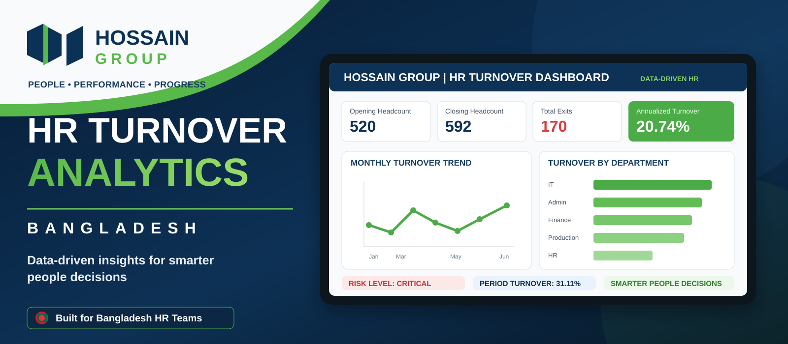
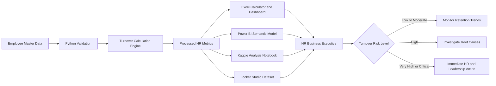

<p align="center">
  
</p>

<h1 align="center">Hossain Group HR Turnover Analytics BD</h1>

<p align="center">
  <strong>A portfolio-ready employee turnover analytics solution built for the Bangladesh HR context.</strong><br>
  From employee records to management-ready insights across Excel, Power BI, Python, Kaggle and Looker Studio.
</p>

<p align="center">
  
  
  
  
  
</p>

<p align="center">
  <a href="#-executive-overview">Overview</a> ·
  <a href="#-project-snapshot">Snapshot</a> ·
  <a href="#-dataset-usage">Dataset Usage</a> ·
  <a href="#-analytics-workflow">Workflow</a> ·
  <a href="#-repository-structure">Structure</a> ·
  <a href="#-quick-start">Quick Start</a> ·
  <a href="SECURITY.md">Security</a>
</p>

---

## ✨ Executive overview

**Hossain Group HR Turnover Analytics BD** is an end-to-end HR analytics portfolio project designed for an **HR Business Executive** working in a Bangladesh-based organisation.

The project transforms synthetic employee joining, headcount and separation records into actionable turnover insights through an Excel calculator, management dashboard, Power BI project, Python automation, Kaggle notebook and Looker Studio-ready dataset.

> **Workflow:** employee records → validation → turnover calculation → risk classification → dashboard reporting → HR action.

<table>
<tr>
<td width="25%" align="center"><strong>762</strong><br>Employee records</td>
<td width="25%" align="center"><strong>242</strong><br>Hires in period</td>
<td width="25%" align="center"><strong>170</strong><br>Employee exits</td>
<td width="25%" align="center"><strong>20.74%</strong><br>Annualized turnover</td>
</tr>
</table>

### What makes this project useful

| Capability | Included |
|---|---|
| **Bangladesh context** | Synthetic Bangladeshi employee names, locations, departments and HR terminology |
| **Excel usability** | Date, department, location and employment-type filters |
| **HR metrics** | Opening, closing and average headcount, hires, exits and turnover |
| **Risk monitoring** | Low, Moderate, High, Very High and Critical classification |
| **BI readiness** | Power BI Project and Looker Studio-ready data |
| **Automation** | Python recalculation, model rebuilding and validation |
| **Portfolio readiness** | GitHub documentation, Kaggle metadata and notebook |
| **Ethical design** | No real employee or confidential organisational data |

---

## 📊 Project snapshot

<table width="100%">
  <thead>
    <tr>
      <th align="left" width="65%">Metric</th>
      <th align="right" width="35%">Result</th>
    </tr>
  </thead>
  <tbody>
    <tr><td align="left">Analysis period</td><td align="right"><strong>01 Jan 2025 – 30 Jun 2026</strong></td></tr>
    <tr><td align="left">Synthetic employee records</td><td align="right"><strong>762</strong></td></tr>
    <tr><td align="left">Opening headcount</td><td align="right"><strong>520</strong></td></tr>
    <tr><td align="left">Closing headcount</td><td align="right"><strong>592</strong></td></tr>
    <tr><td align="left">Average headcount</td><td align="right"><strong>546.44</strong></td></tr>
    <tr><td align="left">Total hires</td><td align="right"><strong>242</strong></td></tr>
    <tr><td align="left">Total exits</td><td align="right"><strong>170</strong></td></tr>
    <tr><td align="left">Period turnover rate</td><td align="right"><strong>31.11%</strong></td></tr>
    <tr><td align="left">Annualized turnover rate</td><td align="right"><strong>20.74%</strong></td></tr>
    <tr><td align="left">Current risk level</td><td align="right"><strong>Critical Risk</strong></td></tr>
  </tbody>
</table>

### Department turnover summary

| Department | Exits | Annualized Turnover | Risk |
|---|---:|---:|---|
| Information Technology | 12 | 23.88% | Critical |
| Administration | 22 | 23.35% | Critical |
| Finance & Accounts | 13 | 22.86% | Critical |
| Quality Assurance | 19 | 22.23% | Critical |
| Production | 62 | 20.81% | Critical |
| Supply Chain | 17 | 19.25% | Very High |
| Sales & Marketing | 18 | 18.76% | Very High |
| Human Resources | 7 | 13.83% | High |

---

## 🧭 Dataset usage

Use this dataset to calculate turnover, compare departments, analyse exit reasons, build dashboards and practise HR reporting with Excel, Power BI, Python, SQL, Kaggle or Looker Studio.

| Start with | Best use |
|---|---|
| `data/raw/employee_master.csv` | Employee-level calculations |
| `excel/Hossain_Group_Employee_Turnover_Calculator.xlsx` | Formula-driven analysis and dashboard |
| `powerbi/Hossain_Group_Turnover.pbip` | Interactive BI reporting |
| `notebooks/Hossain_Group_Turnover_Analysis.ipynb` | Python and Kaggle analysis |
| `looker_studio/hossain_group_looker_studio.csv` | Browser-based dashboarding |

<p align="center">
  <a href="DATASET_USAGE_GUIDE.md"><strong>📘 Open the Complete Dataset Usage Guide</strong></a>
</p>

The detailed guide covers **why, how and where** the dataset can be used, turnover formulas, calculation examples, platform workflows, HR use cases, SQL practice, project ideas, limitations and responsible data handling.

---

## 🎯 Business questions

1. What is the employee turnover rate for a selected period?
2. Which departments have the highest turnover exposure?
3. What are the leading employee exit reasons?
4. How does turnover change month by month?
5. Are hires keeping pace with exits?
6. Which workforce segments require retention action?
7. What should HR communicate to management?

---

## 🧱 Analytics workflow



---

## 🗂️ Repository structure

```mermaid
flowchart TB
    ROOT[Hossain Group HR Turnover Analytics BD]

    ROOT --> ASSETS[assets]
    ASSETS --> COVER[Project cover SVG]

    ROOT --> DATA[data]
    DATA --> RAW[raw / employee master]
    DATA --> PROCESSED[processed / turnover summaries]
    DATA --> META[metadata / data dictionary]

    ROOT --> EXCEL[excel / calculator]
    ROOT --> NOTEBOOKS[notebooks / Kaggle analysis]
    ROOT --> POWERBI[powerbi / report and semantic model]
    ROOT --> LOOKER[looker_studio / reporting CSV]
    ROOT --> SCRIPTS[scripts / generation and validation]
    ROOT --> DOCS[docs / project guides]

    ROOT --> README[README.md]
    ROOT --> USAGE[DATASET_USAGE_GUIDE.md]
    ROOT --> CONTRIB[CONTRIBUTING.md]
    ROOT --> CONDUCT[CODE_OF_CONDUCT.md]
    ROOT --> SECURITY[SECURITY.md]
    ROOT --> CHANGELOG[CHANGELOG.md]
    ROOT --> SUPPORT[SUPPORT.md]
    ROOT --> LICENSE[LICENSE]
```



<details>
<summary><strong>View core file tree</strong></summary>

```text
hossain-group-hr-turnover-analytics-bd/
├── assets/
├── data/
│   ├── raw/employee_master.csv
│   ├── processed/
│   └── metadata/data_dictionary.json
├── docs/
├── excel/Hossain_Group_Employee_Turnover_Calculator.xlsx
├── looker_studio/
├── notebooks/Hossain_Group_Turnover_Analysis.ipynb
├── powerbi/
├── scripts/
├── DATASET_USAGE_GUIDE.md
├── CHANGELOG.md
├── CODE_OF_CONDUCT.md
├── CONTRIBUTING.md
├── SECURITY.md
├── SUPPORT.md
├── LICENSE
└── README.md
```

</details>

---

## 🧮 Metric definitions

```text
Average Headcount = (Opening Headcount + Closing Headcount) / 2
Period Turnover Rate = Employees Exited / Average Headcount
Annualized Turnover Rate = Period Turnover Rate × 12 / Number of Months
```

| Annualized Turnover | Risk Level | Recommended HR response |
|---:|---|---|
| Below 5% | Low | Maintain current retention practices |
| 5% to below 10% | Moderate | Monitor trends and conduct stay interviews |
| 10% to below 15% | High | Investigate manager, pay and career factors |
| 15% to below 20% | Very High | Begin an immediate retention action plan |
| 20% or above | Critical | Escalate for executive review and intervention |

---

## 🧰 Platform readiness

<table>
<tr>
<td width="50%" valign="top">

### 🟩 Excel

- Formula-driven calculator
- Workforce filters
- KPI cards and charts
- Department and exit-reason analysis

</td>
<td width="50%" valign="top">

### 🟨 Power BI

- PBIP project structure
- Power Query M partitions
- Semantic model and DAX measures
- Executive and monthly report pages

</td>
</tr>
<tr>
<td width="50%" valign="top">

### 🐍 Python and Kaggle

- Reproducible turnover calculations
- Trend and department analysis
- Kaggle-ready notebook and metadata

</td>
<td width="50%" valign="top">

### 🟦 Looker Studio

- Upload-ready CSV
- Percentage-ready fields
- Browser-based dashboard support

</td>
</tr>
</table>

---

## 🚀 Quick start

```bash
git clone https://github.com/samusa099/hossain-group-hr-turnover-analytics-bd.git
cd hossain-group-hr-turnover-analytics-bd
python -m pip install -r requirements.txt
python scripts/validate_project.py
python scripts/generate_powerbi_project.py
```

### Excel

```text
excel/Hossain_Group_Employee_Turnover_Calculator.xlsx
```

### Power BI on Windows

```bat
scripts\run_project.bat
```

After Power BI Desktop opens, select **Refresh** and use **File → Save As** to create a `.pbix` file.

---

## 🧪 Validation

```bash
python scripts/validate_project.py
```

Expected result:

```text
PASS: required files, JSON syntax, and CSV structure validated.
```

---

## 📚 Project governance

| Document | Purpose |
|---|---|
| [`DATASET_USAGE_GUIDE.md`](DATASET_USAGE_GUIDE.md) | Complete calculation, platform and HR use-case guide |
| [`CONTRIBUTING.md`](CONTRIBUTING.md) | Contribution workflow and pull-request checklist |
| [`CODE_OF_CONDUCT.md`](CODE_OF_CONDUCT.md) | Professional participation expectations |
| [`SECURITY.md`](SECURITY.md) | Vulnerability and HR data-privacy guidance |
| [`CHANGELOG.md`](CHANGELOG.md) | Version history and improvements |
| [`SUPPORT.md`](SUPPORT.md) | Troubleshooting and issue guidance |
| [`LICENSE`](LICENSE) | Project code licensing terms |

---

## 🔬 Portfolio extension ideas

- Voluntary versus involuntary turnover
- Regrettable and new-hire turnover
- Tenure-band and manager-level analysis
- Recruitment replacement cost
- Employee-retention cost modelling
- Attrition prediction
- Automated monthly HR reporting

---

## 👤 Author

**Musa**  
Human Resources Professional and HR Analytics Practitioner from Bangladesh

---

## ⚖️ License

- **Project code:** MIT License
- **Synthetic dataset:** CC0-1.0 for learning and portfolio use

---

## 🛡️ Data ethics

Hossain Group is used as a fictional project company.

All employee names, joining records, exit records, departments, locations and workforce metrics are synthetic. The project does not contain real organisational or confidential employee information and must not be presented as authentic company HR data.
