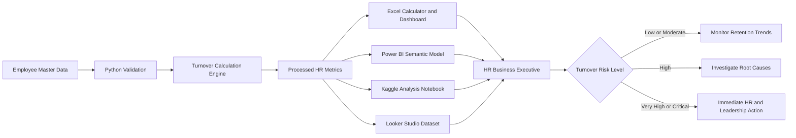

<p align="center">
  
</p>

<h1 align="center">Hossain Group HR Turnover Analytics BD</h1>

<p align="center">
  <strong>A portfolio-ready employee turnover analytics solution built for the Bangladesh HR context.</strong><br>
  From employee records to management-ready insights across Excel, Power BI, Python, Kaggle and Looker Studio.
</p>

<p align="center">
  
  
  
  
  
</p>

<p align="center">
  
  
  
  
  
</p>

<p align="center">
  <a href="#-executive-overview">Executive Overview</a> ·
  <a href="#-project-snapshot">Project Snapshot</a> ·
  <a href="#-analytics-workflow">Workflow</a> ·
  <a href="#-repository-structure">Structure</a> ·
  <a href="#-quick-start">Quick Start</a> ·
  <a href="#-data-ethics">Data Ethics</a>
</p>

---

## ✨ Executive overview

**Hossain Group HR Turnover Analytics BD** is an end-to-end HR analytics portfolio project designed for an **HR Business Executive** working in a Bangladesh-based organisation.

The project converts synthetic employee joining, headcount and separation records into structured turnover insights through a formula-driven Excel calculator, a management dashboard, Power BI project files, Python automation, a Kaggle notebook and a Looker Studio-ready dataset.

> **Analytics workflow:** employee records → validation → turnover calculation → risk classification → dashboard reporting → HR action.

<table>
<tr>
<td width="25%" align="center"><strong>762</strong><br>Employee records</td>
<td width="25%" align="center"><strong>242</strong><br>Hires in period</td>
<td width="25%" align="center"><strong>170</strong><br>Employee exits</td>
<td width="25%" align="center"><strong>20.74%</strong><br>Annualized turnover</td>
</tr>
</table>

### What makes this project useful

| Capability | What is included |
|---|---|
| **Bangladesh context** | Synthetic Bangladeshi employee names, locations, departments and HR terminology |
| **Excel usability** | Interactive date, department, location and employment-type filters |
| **HR metrics** | Opening, closing and average headcount, hires, exits, turnover and annualized turnover |
| **Risk monitoring** | Automatic Low, Moderate, High, Very High and Critical risk classification |
| **BI readiness** | Power BI Project, processed CSV files and Looker Studio-ready data |
| **Automation** | Python scripts for recalculation, semantic-model rebuilding and validation |
| **Portfolio readiness** | GitHub documentation, Kaggle metadata, notebook and structured folders |
| **Ethical design** | Fully synthetic records with no confidential employee information |

---

## 📊 Project snapshot

| Metric | Result |
|---|---:|
| Analysis period | 01 Jan 2025 – 30 Jun 2026 |
| Synthetic employee records | 762 |
| Opening headcount | 520 |
| Closing headcount | 592 |
| Average headcount | 546.44 |
| Total hires | 242 |
| Total exits | 170 |
| Period turnover rate | 31.11% |
| Annualized turnover rate | 20.74% |
| Current risk level | Critical Risk |

### Department turnover summary

| Department | Exits | Period Turnover | Annualized Turnover | Risk |
|---|---:|---:|---:|---|
| Information Technology | 12 | 35.82% | 23.88% | Critical |
| Administration | 22 | 35.03% | 23.35% | Critical |
| Finance & Accounts | 13 | 34.29% | 22.86% | Critical |
| Quality Assurance | 19 | 33.35% | 22.23% | Critical |
| Production | 62 | 31.21% | 20.81% | Critical |
| Supply Chain | 17 | 28.87% | 19.25% | Very High |
| Sales & Marketing | 18 | 28.14% | 18.76% | Very High |
| Human Resources | 7 | 20.74% | 13.83% | High |

### Leading exit reasons

| Exit reason | Exits | Share |
|---|---:|---:|
| Better Opportunity | 32 | 18.82% |
| End of Contract | 22 | 12.94% |
| Career Growth | 22 | 12.94% |
| Performance | 22 | 12.94% |
| Work-Life Balance | 17 | 10.00% |
| Compensation & Benefits | 16 | 9.41% |
| Supervisor / Management | 16 | 9.41% |

---

## 🎯 Business questions

The project helps HR answer:

1. What is the employee turnover rate for a selected period?
2. What is the annualized turnover rate?
3. Which departments have the highest turnover exposure?
4. What are the leading employee exit reasons?
5. How does turnover change month by month?
6. Which workforce segments require immediate retention action?
7. What should HR communicate to management?

---

## 🧱 Analytics workflow



### Data layers

| Layer | Purpose | Location |
|---|---|---|
| **Raw data** | Employee-level source records | `data/raw/` |
| **Processed data** | Monthly, department and exit-reason summaries | `data/processed/` |
| **Metadata** | Field definitions and dataset documentation | `data/metadata/` |
| **Excel** | Formula-driven calculator and dashboard | `excel/` |
| **Power BI** | PBIP report and semantic-model source | `powerbi/` |
| **Automation** | Generation and validation scripts | `scripts/` |
| **Notebook** | Reproducible Python analysis | `notebooks/` |
| **Looker Studio** | Direct-upload reporting dataset | `looker_studio/` |

---

## 🗂️ Repository structure

<details open>
<summary><strong>View project structure</strong></summary>

```text
hossain-group-hr-turnover-analytics-bd/
├── assets/
│   └── hossain-group-hr-turnover-analytics-bd-cover.svg
├── data/
│   ├── raw/
│   │   └── employee_master.csv
│   ├── processed/
│   │   ├── company_monthly_turnover.csv
│   │   ├── dashboard_kpis.csv
│   │   ├── department_monthly_turnover.csv
│   │   ├── department_turnover_summary.csv
│   │   └── exit_reason_summary.csv
│   └── metadata/
│       └── data_dictionary.json
├── docs/
│   ├── METRIC_DEFINITIONS.md
│   ├── POWER_BI_SETUP.md
│   ├── PROJECT_DESCRIPTION.md
│   └── VALIDATION_REPORT.md
├── excel/
│   └── Hossain_Group_Employee_Turnover_Calculator.xlsx
├── looker_studio/
│   ├── hossain_group_looker_studio.csv
│   └── LOOKER_STUDIO_SETUP.md
├── notebooks/
│   └── Hossain_Group_Turnover_Analysis.ipynb
├── powerbi/
│   ├── Hossain_Group_Turnover.pbip
│   ├── Hossain_Group_Turnover.Report/
│   └── Hossain_Group_Turnover.SemanticModel/
├── scripts/
│   ├── generate_powerbi_project.py
│   ├── run_project.bat
│   ├── run_project.ps1
│   └── validate_project.py
├── .gitignore
├── dataset-metadata.json
├── LICENSE
├── README.md
└── requirements.txt
```

</details>

---

## 🧮 Metric definitions

### Average headcount

```text
Average Headcount =
(Opening Headcount + Closing Headcount) / 2
```

### Period turnover rate

```text
Period Turnover Rate =
Employees Exited during Period / Average Headcount
```

### Annualized turnover rate

```text
Annualized Turnover Rate =
Period Turnover Rate × 12 / Number of Months
```

### Risk classification

| Annualized Turnover | Risk Level | HR response |
|---:|---|---|
| Below 5% | Low | Maintain engagement and retention practices |
| 5% to below 10% | Moderate | Monitor trends and conduct stay interviews |
| 10% to below 15% | High | Investigate manager, pay and career factors |
| 15% to below 20% | Very High | Begin an immediate retention action plan |
| 20% or above | Critical | Escalate for executive review and intervention |

---

## 🧰 Platform readiness

<table>
<tr>
<td width="50%">

### 🟩 Excel

- Formula-driven turnover calculator
- Date-range filtering
- Department, location and employment-type filters
- KPI cards and risk classification
- Monthly turnover chart
- Department turnover comparison
- Exit-reason analysis

**Start here:** `excel/Hossain_Group_Employee_Turnover_Calculator.xlsx`

</td>
<td width="50%">

### 🟨 Power BI

- Source-control-friendly PBIP project
- Power Query M partitions
- Semantic model and DAX measures
- Executive Overview page
- Monthly Detail page
- Python-powered local path rebuilding

**Start here:** `powerbi/Hossain_Group_Turnover.pbip`

</td>
</tr>
<tr>
<td width="50%">

### 🐍 Python and Kaggle

- Reproducible turnover calculation
- Monthly trend analysis
- Department comparison
- Exit-reason exploration
- Kaggle-ready notebook and metadata

**Start here:** `notebooks/Hossain_Group_Turnover_Analysis.ipynb`

</td>
<td width="50%">

### 🟦 Looker Studio

- Flat upload-ready CSV
- Monthly and department metrics
- Percentage-ready turnover fields
- Setup instructions and chart recommendations

**Start here:** `looker_studio/`

</td>
</tr>
</table>

---

## 🚀 Quick start

### Clone the repository

```bash
git clone https://github.com/samusa099/hossain-group-hr-turnover-analytics-bd.git
cd hossain-group-hr-turnover-analytics-bd
```

### Install Python requirements

```bash
python -m pip install -r requirements.txt
```

### Validate the project

```bash
python scripts/validate_project.py
```

Expected output:

```text
PASS: required files, JSON syntax, and CSV structure validated.
```

### Regenerate processed data

```bash
python scripts/generate_powerbi_project.py
```

### Open the Excel calculator

```text
excel/Hossain_Group_Employee_Turnover_Calculator.xlsx
```

### Open the Power BI project on Windows

```bat
scripts\run_project.bat
```

The script recalculates the processed files, updates local Power Query paths and opens:

```text
powerbi/Hossain_Group_Turnover.pbip
```

After opening Power BI Desktop:

1. Select **Refresh**.
2. Review the Executive Overview and Monthly Detail pages.
3. Use **File → Save As** to create a `.pbix` file.

---

## 📘 Excel workbook guide

| Sheet | Purpose |
|---|---|
| `README` | Workbook instructions |
| `Employee_Data` | Employee-level source records |
| `Lookup_Lists` | Filter lists |
| `Turnover_Calculator` | Interactive turnover calculation |
| `Monthly_Summary` | Monthly headcount and turnover |
| `Department_Summary` | Department-level comparison |
| `Exit_Reason_Summary` | Exit-reason distribution |
| `Dashboard` | Management-ready visual summary |
| `Data_Dictionary` | Field and metric definitions |

---

## 📦 Data files

| File | Primary use |
|---|---|
| `employee_master.csv` | Employee-level HR analysis |
| `company_monthly_turnover.csv` | Company monthly trend |
| `department_monthly_turnover.csv` | Department and month analysis |
| `department_turnover_summary.csv` | Department risk comparison |
| `exit_reason_summary.csv` | Exit-reason analysis |
| `dashboard_kpis.csv` | Power BI KPI cards |
| `hossain_group_looker_studio.csv` | Looker Studio reporting |

---

## 🧪 Validation and governance

The project validates:

- required project files;
- JSON syntax;
- CSV headers and data rows;
- Excel workbook presence;
- Kaggle notebook presence;
- Power BI report source;
- Power BI semantic model;
- processed data availability.

Run:

```bash
python scripts/validate_project.py
```

---

## 🔬 Portfolio extension ideas

- Voluntary versus involuntary turnover
- Regrettable turnover
- New-hire turnover
- Tenure-band analysis
- Manager-level turnover
- Gender and diversity analysis
- Department risk scoring
- Recruitment replacement cost
- Employee-retention cost modeling
- Attrition prediction
- Absence and turnover correlation
- Automated monthly HR reporting

---

## 👤 Author

**Siam Ahmad Musa**  
Human Resources Professional and HR Analytics Practitioner from Bangladesh

---

## ⚖️ License

- **Project code:** MIT License
- **Synthetic dataset:** CC0-1.0 for learning and portfolio use

---

## 🛡️ Data ethics

Hossain Group is used as a fictional project company.

All employee names, joining records, exit records, departments, locations and workforce metrics are synthetic. The project does not contain real organisational or confidential employee information and must not be presented as authentic company HR data.