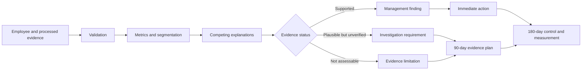

<p align="center">
  
</p>

<h1 align="center">Hossain Group HR Turnover Analytics BD</h1>

<p align="center">
  <strong>A Bangladesh-focused HR analytics portfolio and controlled workforce-management simulation.</strong><br>
  From synthetic employee records to validated metrics, dashboards, role-based decisions and protected participant submissions.
</p>

<p align="center">
  
  
  
  
  
  
  
  
</p>

<p align="center">
  <a href="https://github.com/samusa099/hossain-group-hr-turnover-analytics-bd/actions/workflows/security-and-validation.yml"></a>
  <a href="https://github.com/samusa099/hossain-group-hr-turnover-analytics-bd/actions/workflows/validate-case-submission.yml"></a>
  <a href="https://github.com/samusa099/hossain-group-hr-turnover-analytics-bd/actions/workflows/codeql.yml"></a>
  
  
  
  
</p>

<p align="center">
  <a href="#-executive-overview">Overview</a> ·
  <a href="#-project-snapshot">Snapshot</a> ·
  <a href="#-role-based-case-study">Case Study</a> ·
  <a href="#-dataset-and-project-evidence">Evidence</a> ·
  <a href="#-controlled-participant-submissions">Submissions</a> ·
  <a href="#-repository-structure">Structure</a> ·
  <a href="#-quick-start">Quick Start</a> ·
  <a href="SECURITY.md">Security</a>
</p>

---

## ✨ Executive overview

**Hossain Group HR Turnover Analytics BD** is an end-to-end HR analytics portfolio project designed for the Bangladesh business context. Version `1.3.0` extends the original calculation and dashboard project into a controlled, role-based management simulation.

The project now has three publication layers:

| Layer | Purpose |
|---|---|
| **Official case** | Narrative, ambiguity, executive mandate, role briefs, legal-research requirement and rubric |
| **Existing project evidence** | One validated employee dataset, processed metrics, Excel, Power BI, Python, Kaggle and Looker Studio assets |
| **Participant submissions** | Restricted pull-request area containing a professional PDF and optional cleared notebook |

> **Decision objective:** establish what the evidence supports, what remains uncertain, what management can do now and what requires additional investigation.

<div align="center">
<table width="78%">
<tr>
<td width="25%" align="center"><strong>762</strong><br>Synthetic employee records</td>
<td width="25%" align="center"><strong>242</strong><br>Hires in period</td>
<td width="25%" align="center"><strong>170</strong><br>Employee exits</td>
<td width="25%" align="center"><strong>20.74%</strong><br>Annualized turnover</td>
</tr>
</table>
</div>

### What makes this release different

| Capability | Included |
|---|---|
| **Bangladesh context** | Synthetic local employee, location, department and HR terminology |
| **Validated analytics** | Opening, closing and average headcount, hires, exits and turnover |
| **Role-based simulation** | Executive, HRBP, analytics, operations-finance and governance perspectives |
| **Evidence discipline** | Fact, opinion, allegation, uncertainty and research need must be separated |
| **Legal-research boundary** | Current official Bangladesh sources must be independently verified |
| **Protected contributions** | Fork, pull request, path validation, CODEOWNERS and protected main branch |
| **Clean publication** | GitHub source of truth with approved Kaggle archives only |
| **Ethical design** | No real employee or confidential organisational data |

---

## 📊 Project snapshot

<div align="center">
<table width="70%">
  <thead>
    <tr><th align="center" width="62%">Metric</th><th align="center" width="38%">Result</th></tr>
  </thead>
  <tbody>
    <tr><td align="center">Analysis period</td><td align="center"><strong>01 Jan 2025 – 30 Jun 2026</strong></td></tr>
    <tr><td align="center">Synthetic employee records</td><td align="center"><strong>762</strong></td></tr>
    <tr><td align="center">Opening headcount</td><td align="center"><strong>520</strong></td></tr>
    <tr><td align="center">Closing headcount</td><td align="center"><strong>592</strong></td></tr>
    <tr><td align="center">Average headcount</td><td align="center"><strong>546.44</strong></td></tr>
    <tr><td align="center">Total hires</td><td align="center"><strong>242</strong></td></tr>
    <tr><td align="center">Total exits</td><td align="center"><strong>170</strong></td></tr>
    <tr><td align="center">Period turnover rate</td><td align="center"><strong>31.11%</strong></td></tr>
    <tr><td align="center">Annualized turnover rate</td><td align="center"><strong>20.74%</strong></td></tr>
    <tr><td align="center">Published risk classification</td><td align="center"><strong>Critical</strong></td></tr>
  </tbody>
</table>
</div>

These published indicators are evidence inputs, not a complete root-cause conclusion. The case requires participants to determine what the data can and cannot establish.

---

## 🎭 Role-based case study

The official simulation begins with conflicting management accounts involving manpower pressure, replacement hiring, attendance concerns, workforce continuity, employee comments and fragmented HR records.

The public case does **not** disclose:

- the correct diagnosis;
- the most problematic department as a solved answer;
- a required dashboard layout;
- a completed root-cause tree;
- a model recommendation;
- a difficulty percentage;
- pre-calculated financial benefit.

### Start the case

1. Read [`case-study/CASE_NARRATIVE.md`](case-study/CASE_NARRATIVE.md).
2. Review [`case-study/MANAGEMENT_CONTEXT.md`](case-study/MANAGEMENT_CONTEXT.md).
3. Read [`case-study/EXECUTIVE_MANDATE.md`](case-study/EXECUTIVE_MANDATE.md).
4. Select a role from [`case-study/ROLE_TRACKS.md`](case-study/ROLE_TRACKS.md).
5. Follow [`case-study/SUBMISSION_REQUIREMENTS.md`](case-study/SUBMISSION_REQUIREMENTS.md).
6. Review [`case-study/RUBRIC.md`](case-study/RUBRIC.md).

<p align="center">
  <a href="case-study/README.md"><strong>🧭 Open the Official Case Study</strong></a>
</p>

### Available tracks

| Track | Primary emphasis |
|---|---|
| Managing Director | Enterprise risk, accountability and intervention approval |
| HR Business Partner | Department diagnosis, employee relations and action design |
| People Analytics | Data quality, metric validation, segmentation and analytical limits |
| Operations and Finance | Workforce continuity, replacement pressure and prioritisation |
| Policy and Governance | Policy consistency, auditability, legal alignment and control design |
| Hybrid | Two connected perspectives with one declared primary decision-maker |

---

## 🧭 Dataset and project evidence

The existing files remain the only quantitative source of truth.

| Start with | Best use |
|---|---|
| `data/raw/employee_master.csv` | Employee-level calculations and segmentation |
| `data/processed/` | Validated company, department, monthly and exit-reason summaries |
| `data/metadata/data_dictionary.json` | Field definitions and data interpretation |
| `excel/Hossain_Group_Employee_Turnover_Calculator.xlsx` | Formula-driven analysis and dashboard |
| `powerbi/Hossain_Group_Turnover.pbip` | Interactive BI reporting source |
| `notebooks/Hossain_Group_Turnover_Analysis.ipynb` | Reproducible Python and Kaggle analysis |
| `looker_studio/hossain_group_looker_studio.csv` | Browser-based dashboarding |

No alternative salary, attendance, performance, promotion, grievance, manager, recruitment-cost, productivity or legal dataset is supplied.

Where the evidence cannot support a conclusion, use:

> **Insufficient evidence to conclude.**

<p align="center">
  <a href="DATASET_USAGE_GUIDE.md"><strong>📘 Open the Complete Dataset Usage Guide</strong></a>
</p>

---

## 🔐 Controlled participant submissions

External contributors do not receive direct write access. The contribution flow is:

```text
Fork
→ submission branch
→ files under the participant path
→ pull request
→ automated scope validation
→ maintainer review
→ protected main branch
```

### Branch and path

```text
Branch: submission/<github-username>/<selected-role>
Path:   submissions/<github-username>/<submission-id>/
```

### Required files

```text
README.md
report.pdf
```

Optional:

```text
analysis.ipynb
supporting-dashboard.png
```

The required policy check is:

```text
Validate participant submission scope
```

It validates author path, one submission per pull request, required files, extension policy, size limits, PDF signature, notebook JSON and outputs, secret patterns and the synthetic-data declaration.

Administrative details are documented in [`docs/CASE_SUBMISSION_PROTECTION.md`](docs/CASE_SUBMISSION_PROTECTION.md).

---

## 🇧🇩 Policy, governance and legal research

Participants must independently verify any current Bangladesh legal or regulatory issue from official sources applicable on the submission date. A strong submission explains:

- the official issue identified;
- why it is relevant to the case;
- whether the current data can assess it;
- which additional evidence is required;
- which policy, approval, documentation or reporting control should change.

The case does not embed an unverified claim about a “new labour law.” See [`case-study/POLICY_AND_LEGAL_RESEARCH.md`](case-study/POLICY_AND_LEGAL_RESEARCH.md).

---

## 🧱 Analytics and decision workflow



---

## 🗂️ Repository structure

```text
hossain-group-hr-turnover-analytics-bd/
├── case-study/                 # official role-based case materials
│   └── variants/               # role-specific management briefs
├── submissions/                # controlled participant contribution area
├── data/
│   ├── raw/employee_master.csv
│   ├── processed/
│   └── metadata/data_dictionary.json
├── excel/
├── notebooks/
├── powerbi/
├── looker_studio/
├── kaggle/dataset/
├── scripts/
├── docs/
├── release/
├── RELEASE_NOTES_v1.3.0.md
├── VERSION
├── CITATION.cff
└── README.md
```

The Kaggle publication builder copies only approved evidence, documentation, the notebook and official case Markdown files. It excludes participant submissions, `.github/`, rulesets, `.pbix`, secrets and unrelated development files.

---

## 🚀 Quick start

```bash
git clone https://github.com/samusa099/hossain-group-hr-turnover-analytics-bd.git
cd hossain-group-hr-turnover-analytics-bd
python -m pip install -r requirements.txt
python scripts/validate_project.py
python scripts/prepare_kaggle_dataset.py --output .kaggle-build/dataset
```

### Excel

```text
excel/Hossain_Group_Employee_Turnover_Calculator.xlsx
```

### Power BI on Windows

```bat
scripts\run_project.bat
```

After Power BI Desktop opens, select **Refresh** and use **File → Save As** to create a local `.pbix` file. Generated `.pbix` files remain outside normal Git source control.

---

## 📦 Publication

| Channel | Publication behaviour |
|---|---|
| GitHub | Protected source repository and participant review workflow |
| GitHub Release | Guarded publication from `release/RELEASE_VERSION` and versioned release notes |
| Kaggle Dataset | Clean archives for raw, processed, metadata, project and official case materials |

Publication instructions: [`docs/CASE_STUDY_PUBLISHING_GUIDE.md`](docs/CASE_STUDY_PUBLISHING_GUIDE.md)

Release notes: [`RELEASE_NOTES_v1.3.0.md`](RELEASE_NOTES_v1.3.0.md)

---

## 📚 Project governance

| Document | Purpose |
|---|---|
| [`case-study/README.md`](case-study/README.md) | Official case landing page |
| [`submissions/README.md`](submissions/README.md) | Participant contribution workflow |
| [`DATASET_USAGE_GUIDE.md`](DATASET_USAGE_GUIDE.md) | Calculation, platform and HR use-case guide |
| [`docs/CASE_SUBMISSION_PROTECTION.md`](docs/CASE_SUBMISSION_PROTECTION.md) | Technical contribution protection |
| [`docs/CASE_STUDY_PUBLISHING_GUIDE.md`](docs/CASE_STUDY_PUBLISHING_GUIDE.md) | GitHub Release and Kaggle publication runbook |
| [`CONTRIBUTING.md`](CONTRIBUTING.md) | General contribution guidance |
| [`CODE_OF_CONDUCT.md`](CODE_OF_CONDUCT.md) | Professional participation expectations |
| [`SECURITY.md`](SECURITY.md) | Vulnerability and HR data-privacy guidance |
| [`CHANGELOG.md`](CHANGELOG.md) | Version history |
| [`LICENSE`](LICENSE) | Project licensing terms |

---

## 👤 Author

**Musa**  
Human Resources Professional and HR Analytics Practitioner from Bangladesh

---

## ⚖️ Licence and responsible use

- **Project code:** MIT License
- **Synthetic dataset:** CC0-1.0 for learning and portfolio use

Hossain Group is used as a fictional project company. All employee names, joining records, exit records, departments, locations and workforce metrics are synthetic. The project does not contain real organisational or confidential employee information and must not be presented as authentic company HR data.
