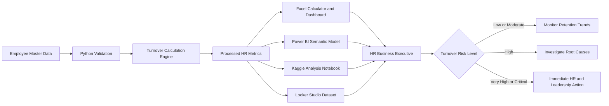

<p align="center">
  
</p>

<h1 align="center">Hossain Group HR Turnover Analytics BD</h1>

<p align="center">
  <strong>A portfolio-ready employee turnover analytics solution built for the Bangladesh HR context.</strong><br>
  From employee records to management-ready insights across Excel, Power BI, Python, Kaggle and Looker Studio.
</p>

<p align="center">
  
  
  
  
  
</p>

<p align="center">
  
  
  
  
  
</p>

<p align="center">
  <a href="#-executive-overview">Executive Overview</a> ·
  <a href="#-project-snapshot">Project Snapshot</a> ·
  <a href="#-analytics-workflow">Workflow</a> ·
  <a href="#-repository-structure">Structure</a> ·
  <a href="#-quick-start">Quick Start</a> ·
  <a href="#-project-governance">Governance</a>
</p>

---

## ✨ Executive overview

**Hossain Group HR Turnover Analytics BD** is an end-to-end HR analytics portfolio project designed for an **HR Business Executive** working in a Bangladesh-based organisation.

The project converts synthetic employee joining, headcount and separation records into structured turnover insights through a formula-driven Excel calculator, a management dashboard, Power BI project files, Python automation, a Kaggle notebook and a Looker Studio-ready dataset.

> **Analytics workflow:** employee records → validation → turnover calculation → risk classification → dashboard reporting → HR action.

<table>
<tr>
<td width="25%" align="center"><strong>762</strong><br>Employee records</td>
<td width="25%" align="center"><strong>242</strong><br>Hires in period</td>
<td width="25%" align="center"><strong>170</strong><br>Employee exits</td>
<td width="25%" align="center"><strong>20.74%</strong><br>Annualized turnover</td>
</tr>
</table>

### What makes this project useful

| Capability | What is included |
|---|---|
| **Bangladesh context** | Synthetic Bangladeshi employee names, locations, departments and HR terminology |
| **Excel usability** | Interactive date, department, location and employment-type filters |
| **HR metrics** | Opening, closing and average headcount, hires, exits and turnover |
| **Risk monitoring** | Automatic Low, Moderate, High, Very High and Critical classification |
| **BI readiness** | Power BI Project, processed CSV files and Looker Studio-ready data |
| **Automation** | Python scripts for recalculation, model rebuilding and validation |
| **Portfolio readiness** | GitHub documentation, Kaggle metadata and reproducible notebook |
| **Ethical design** | Fully synthetic records with no confidential employee information |

---

## 📊 Project snapshot

<table width="100%">
  <thead>
    <tr>
      <th align="left" width="65%">Metric</th>
      <th align="right" width="35%">Result</th>
    </tr>
  </thead>
  <tbody>
    <tr><td align="left">Analysis period</td><td align="right"><strong>01 Jan 2025 – 30 Jun 2026</strong></td></tr>
    <tr><td align="left">Synthetic employee records</td><td align="right"><strong>762</strong></td></tr>
    <tr><td align="left">Opening headcount</td><td align="right"><strong>520</strong></td></tr>
    <tr><td align="left">Closing headcount</td><td align="right"><strong>592</strong></td></tr>
    <tr><td align="left">Average headcount</td><td align="right"><strong>546.44</strong></td></tr>
    <tr><td align="left">Total hires</td><td align="right"><strong>242</strong></td></tr>
    <tr><td align="left">Total exits</td><td align="right"><strong>170</strong></td></tr>
    <tr><td align="left">Period turnover rate</td><td align="right"><strong>31.11%</strong></td></tr>
    <tr><td align="left">Annualized turnover rate</td><td align="right"><strong>20.74%</strong></td></tr>
    <tr><td align="left">Current risk level</td><td align="right"><strong>Critical Risk</strong></td></tr>
  </tbody>
</table>

### Department turnover summary

| Department | Exits | Annualized Turnover | Risk |
|---|---:|---:|---|
| Information Technology | 12 | 23.88% | Critical |
| Administration | 22 | 23.35% | Critical |
| Finance & Accounts | 13 | 22.86% | Critical |
| Quality Assurance | 19 | 22.23% | Critical |
| Production | 62 | 20.81% | Critical |
| Supply Chain | 17 | 19.25% | Very High |
| Sales & Marketing | 18 | 18.76% | Very High |
| Human Resources | 7 | 13.83% | High |

### Leading exit reasons

| Exit reason | Exits | Share |
|---|---:|---:|
| Better Opportunity | 32 | 18.82% |
| End of Contract | 22 | 12.94% |
| Career Growth | 22 | 12.94% |
| Performance | 22 | 12.94% |
| Work-Life Balance | 17 | 10.00% |
| Compensation & Benefits | 16 | 9.41% |
| Supervisor / Management | 16 | 9.41% |

---

## 🎯 Business questions

1. What is the employee turnover rate for a selected period?
2. What is the annualized turnover rate?
3. Which departments have the highest turnover exposure?
4. What are the leading employee exit reasons?
5. How does turnover change month by month?
6. Which workforce segments require immediate retention action?
7. What should HR communicate to management?

---

## 🧱 Analytics workflow



---

## 🗂️ Repository structure

```mermaid
flowchart TB
    ROOT[Hossain Group HR Turnover Analytics BD]

    ROOT --> ASSETS[assets]
    ASSETS --> COVER[Project cover SVG]

    ROOT --> DATA[data]
    DATA --> RAW[raw / employee_master.csv]
    DATA --> PROCESSED[processed / turnover summaries]
    DATA --> META[metadata / data_dictionary.json]

    ROOT --> EXCEL[excel / turnover calculator]
    ROOT --> NOTEBOOKS[notebooks / Kaggle analysis]
    ROOT --> POWERBI[powerbi / PBIP report and semantic model]
    ROOT --> LOOKER[looker_studio / upload-ready CSV]
    ROOT --> SCRIPTS[scripts / generation and validation]
    ROOT --> DOCS[docs / project and platform guides]

    ROOT --> README[README.md]
    ROOT --> CONTRIB[CONTRIBUTING.md]
    ROOT --> CONDUCT[CODE_OF_CONDUCT.md]
    ROOT --> SECURITY[SECURITY.md]
    ROOT --> CHANGELOG[CHANGELOG.md]
    ROOT --> SUPPORT[SUPPORT.md]
    ROOT --> LICENSE[LICENSE]
```



<details>
<summary><strong>View detailed file tree</strong></summary>

```text
hossain-group-hr-turnover-analytics-bd/
├── assets/
│   └── hossain-group-hr-turnover-analytics-bd-cover.svg
├── data/
│   ├── raw/employee_master.csv
│   ├── processed/
│   └── metadata/data_dictionary.json
├── docs/
│   ├── METRIC_DEFINITIONS.md
│   ├── POWER_BI_SETUP.md
│   ├── PROJECT_DESCRIPTION.md
│   └── VALIDATION_REPORT.md
├── excel/Hossain_Group_Employee_Turnover_Calculator.xlsx
├── looker_studio/
├── notebooks/Hossain_Group_Turnover_Analysis.ipynb
├── powerbi/
├── scripts/
├── CHANGELOG.md
├── CODE_OF_CONDUCT.md
├── CONTRIBUTING.md
├── SECURITY.md
├── SUPPORT.md
├── LICENSE
├── README.md
└── requirements.txt
```

</details>

---

## 🧮 Metric definitions

```text
Average Headcount = (Opening Headcount + Closing Headcount) / 2
Period Turnover Rate = Employees Exited / Average Headcount
Annualized Turnover Rate = Period Turnover Rate × 12 / Number of Months
```

### Risk classification

| Annualized Turnover | Risk Level | HR response |
|---:|---|---|
| Below 5% | Low | Maintain engagement and retention practices |
| 5% to below 10% | Moderate | Monitor trends and conduct stay interviews |
| 10% to below 15% | High | Investigate manager, pay and career factors |
| 15% to below 20% | Very High | Begin an immediate retention action plan |
| 20% or above | Critical | Escalate for executive review and intervention |

---

## 🧰 Platform readiness

<table>
<tr>
<td width="50%">

### 🟩 Excel

- Formula-driven turnover calculator
- Date, department, location and employment-type filters
- KPI cards and risk classification
- Monthly, department and exit-reason analysis

**Start here:** `excel/Hossain_Group_Employee_Turnover_Calculator.xlsx`

</td>
<td width="50%">

### 🟨 Power BI

- Source-control-friendly PBIP project
- Power Query M partitions
- Semantic model and DAX measures
- Executive Overview and Monthly Detail pages

**Start here:** `powerbi/Hossain_Group_Turnover.pbip`

</td>
</tr>
<tr>
<td width="50%">

### 🐍 Python and Kaggle

- Reproducible turnover calculation
- Monthly and department analysis
- Kaggle-ready notebook and metadata

**Start here:** `notebooks/Hossain_Group_Turnover_Analysis.ipynb`

</td>
<td width="50%">

### 🟦 Looker Studio

- Flat upload-ready CSV
- Percentage-ready turnover fields
- Setup instructions and chart recommendations

**Start here:** `looker_studio/`

</td>
</tr>
</table>

---

## 🚀 Quick start

```bash
git clone https://github.com/samusa099/hossain-group-hr-turnover-analytics-bd.git
cd hossain-group-hr-turnover-analytics-bd
python -m pip install -r requirements.txt
python scripts/validate_project.py
python scripts/generate_powerbi_project.py
```

### Excel

Open:

```text
excel/Hossain_Group_Employee_Turnover_Calculator.xlsx
```

### Power BI on Windows

```bat
scripts\run_project.bat
```

After Power BI Desktop opens, select **Refresh** and use **File → Save As** to create a `.pbix` file.

---

## 🧪 Validation and governance

The project validates required files, JSON syntax, CSV headers and rows, Excel workbook presence, notebook presence, Power BI source files and processed datasets.

```bash
python scripts/validate_project.py
```

Expected result:

```text
PASS: required files, JSON syntax, and CSV structure validated.
```

---

## 📚 Project governance

| Document | Purpose |
|---|---|
| [`CONTRIBUTING.md`](CONTRIBUTING.md) | Contribution workflow, standards and pull-request checklist |
| [`CODE_OF_CONDUCT.md`](CODE_OF_CONDUCT.md) | Professional and inclusive participation expectations |
| [`SECURITY.md`](SECURITY.md) | Vulnerability reporting and HR data-privacy requirements |
| [`CHANGELOG.md`](CHANGELOG.md) | Version history, additions and planned improvements |
| [`SUPPORT.md`](SUPPORT.md) | Troubleshooting scope and issue-reporting guidance |
| [`LICENSE`](LICENSE) | Project code licensing terms |

---

## 🔬 Portfolio extension ideas

- Voluntary versus involuntary turnover
- Regrettable and new-hire turnover
- Tenure-band and manager-level analysis
- Recruitment replacement cost
- Employee-retention cost modelling
- Attrition prediction
- Automated monthly HR reporting

---

## 👤 Author

**Siam Ahmad Musa**  
Human Resources Professional and HR Analytics Practitioner from Bangladesh

---

## ⚖️ License

- **Project code:** MIT License
- **Synthetic dataset:** CC0-1.0 for learning and portfolio use

---

## 🛡️ Data ethics

Hossain Group is used as a fictional project company.

All employee names, joining records, exit records, departments, locations and workforce metrics are synthetic. The project does not contain real organisational or confidential employee information and must not be presented as authentic company HR data.