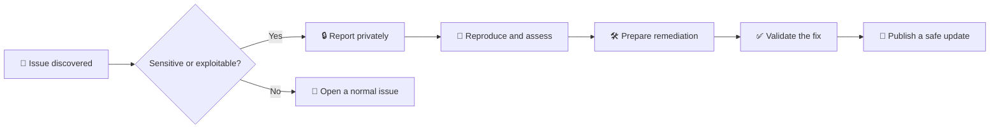
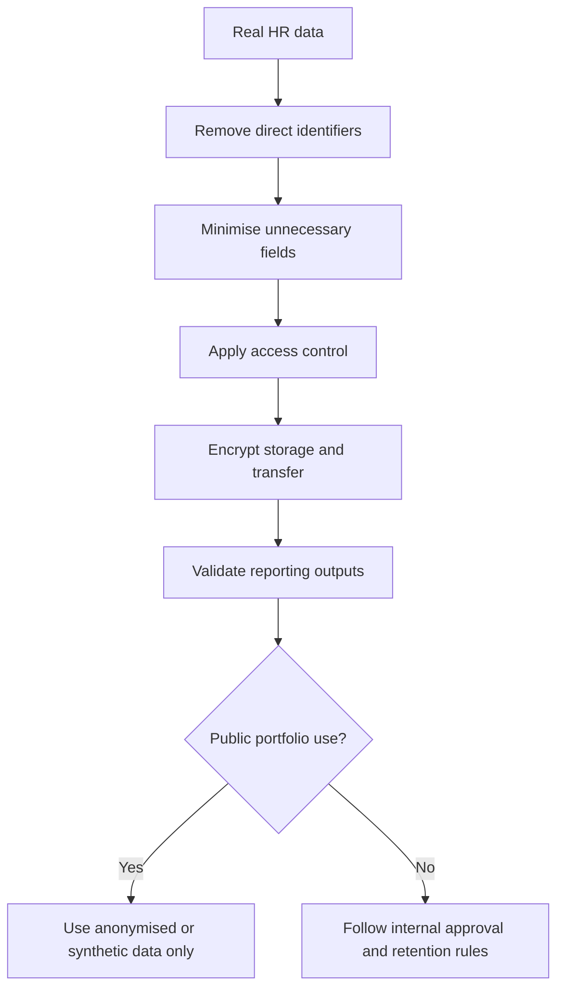

<p align="center">
  
  
  
  
</p>

<h1 align="center">🔐 Security & HR Data Privacy Policy</h1>

<p align="center">
  <strong>Responsible disclosure, safe local execution and privacy-first handling of workforce data.</strong>
</p>

---

## 🧭 Policy at a glance

| Area | Repository rule |
|---|---|
| 🛡️ **Security reports** | Report privately; do not publish exploitable details in a public issue |
| 👥 **Employee data** | Only synthetic HR records belong in this public repository |
| 🔑 **Secrets** | Never commit passwords, tokens, API keys or connection strings |
| 💻 **Local execution** | Review scripts and use a trusted environment before running them |
| 📊 **Power BI paths** | Do not commit private usernames, network paths or embedded credentials |
| 📦 **Dependencies** | Install only from the project requirements and keep tools updated |

> **Important:** This is a public portfolio and learning repository, not a production HR information system.

---

## ✅ Supported scope

Security support applies to:

- the current default branch;
- the latest repository documentation;
- project scripts and notebooks;
- Excel, Power BI and Looker Studio source files;
- accidental exposure of confidential data, secrets or unsafe local paths.

Older downloaded copies, modified forks and third-party deployments are outside the maintained scope of this repository.

---

## 🚨 Reporting a security or privacy issue

Please **do not open a public GitHub issue** when a report involves:

- exposed credentials or tokens;
- sensitive employee or company data;
- malicious code execution;
- unsafe dependency behaviour;
- private usernames or network paths;
- a reproducible privacy leak.

Use the repository owner's available private GitHub profile contact method.

### Include this information

```text
Issue type:
Affected file or component:
Repository version or commit:
Clear description:
Reproduction steps:
Potential impact:
Evidence or screenshots:
Suggested remediation, if known:
```

### Disclosure workflow



Please allow reasonable time for investigation and remediation before public disclosure.

---

## 📊 Severity guidance

| Severity | Example | Recommended handling |
|---|---|---|
| 🚨 **Critical** | Active credential exposure or executable malicious code | Report privately and stop using the affected component |
| 🔴 **High** | Real employee data or confidential company information committed publicly | Report privately and request immediate removal |
| 🟠 **Medium** | Private local paths, unsafe configuration or reproducible data leakage | Report privately with reproduction details |
| 🟡 **Low** | Documentation gap or hardening recommendation | Use a normal issue when no sensitive details are exposed |

This table supports triage; final severity depends on actual exploitability and impact.

---

## 👥 Sensitive HR data

This public repository must never contain:

- real employee names linked to employment records;
- national identification, passport or tax numbers;
- personal addresses, phone numbers or private email addresses;
- payroll bank details or salary records tied to individuals;
- medical, disability or benefit information;
- disciplinary, grievance or investigation records;
- biometric, attendance-device or authentication data;
- confidential company information;
- production credentials or internal system details.

All employee records currently included in the project are synthetic.

### Before using real organisational data



Apply appropriate anonymisation, access control, retention, encryption and internal approval procedures before organisational use.

---

## 🔑 Secrets and credentials

Never commit:

```text
API keys
Passwords
Personal access tokens
Database connection strings
Cloud credentials
Private certificates
Service-account files
Environment-specific secrets
```

Use environment variables or an excluded local configuration file instead.

### Recommended local pattern

```text
.env                  # local only
.env.example          # placeholders only
.gitignore            # excludes .env and secret files
```

Before every push, review staged changes:

```bash
git diff --cached
git status
```

---

## 💻 Dependency and file safety

Before running project scripts:

1. review the source code;
2. use a Python virtual environment;
3. install dependencies from `requirements.txt`;
4. keep Python, Power BI Desktop and spreadsheet software updated;
5. scan downloaded archives when working outside GitHub;
6. avoid enabling unknown macros or external connections;
7. validate output paths before generating files.

### Suggested Python setup

```bash
python -m venv .venv
```

```bash
# Windows
.venv\Scripts\activate
```

```bash
python -m pip install --upgrade pip
python -m pip install -r requirements.txt
```

---

## 📈 Power BI and local-path safety

The Power BI generator writes local file paths into semantic-model source files.

Do not commit paths containing:

- private usernames;
- confidential network locations;
- customer or employee names;
- embedded credentials;
- internal server addresses.

Run the generator only in a trusted local environment, inspect generated changes and confirm that source files contain safe paths before pushing.

---

## 🧪 Pre-push security checklist

- [ ] No real employee or confidential company data is included
- [ ] No passwords, tokens, API keys or connection strings are present
- [ ] Generated Power BI paths do not expose private local information
- [ ] CSV, JSON and Excel outputs have been reviewed
- [ ] Notebook outputs do not reveal local paths or sensitive data
- [ ] Dependencies come from the documented requirements
- [ ] `git diff --cached` has been checked
- [ ] Public documentation clearly states that the data is synthetic

---

## 🛠️ Disclosure response

A confirmed issue may result in:

- documentation changes;
- code or configuration fixes;
- removal of exposed files;
- replacement of synthetic outputs;
- credential rotation by the affected owner;
- a new release or `CHANGELOG.md` entry;
- additional validation or privacy controls.

No guaranteed response-time SLA is provided for this portfolio repository, but credible reports will be reviewed as reasonably as possible.

---

## 📚 Related documents

| Document | Purpose |
|---|---|
| [`README.md`](README.md) | Project overview and quick start |
| [`DATASET_USAGE_GUIDE.md`](DATASET_USAGE_GUIDE.md) | Dataset calculations and responsible usage |
| [`CONTRIBUTING.md`](CONTRIBUTING.md) | Contribution and pull-request standards |
| [`CODE_OF_CONDUCT.md`](CODE_OF_CONDUCT.md) | Professional community expectations |
| [`SUPPORT.md`](SUPPORT.md) | General troubleshooting guidance |

---

<p align="center">
  <strong>Protect people data before analysing people data.</strong> 🛡️
</p>
