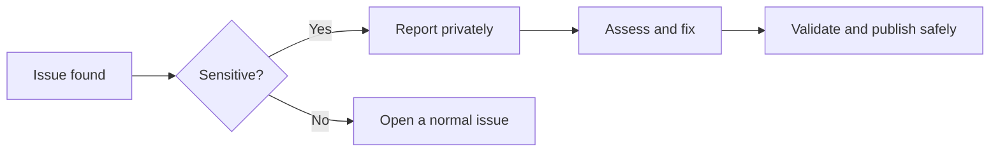

<p align="center">
  
  
  
</p>

<h1 align="center">🔐 Security & HR Data Privacy</h1>

<p align="center">
  <strong>Responsible disclosure and privacy-first handling of workforce data.</strong>
</p>

---

## 🧭 Core policy

| Area | Requirement |
|---|---|
| 🛡️ Security reports | Report sensitive issues privately |
| 👥 HR data | Only synthetic records belong in this public repository |
| 🔑 Secrets | Never commit passwords, tokens, keys or credentials |
| 📊 Power BI | Remove private usernames, paths and embedded credentials |
| 💻 Local use | Review scripts and dependencies before running them |

> This is a public portfolio project, not a production HR information system.

---

## 🚨 Reporting an issue

Do **not** open a public issue for exposed credentials, real employee data, malicious code, confidential company information or reproducible privacy leaks.

Use the repository owner's private GitHub profile contact method and include:

```text
Issue type:
Affected file:
Commit or version:
Description:
Reproduction steps:
Potential impact:
Suggested fix, if known:
```



---

## 👥 Prohibited HR data

This repository must not contain:

- real employee identities linked to employment records;
- national ID, passport or tax numbers;
- personal addresses, phone numbers or private emails;
- payroll, bank, medical, disability or biometric information;
- disciplinary or grievance records;
- confidential company information;
- production credentials or internal system details.

All employee records included in this project are synthetic.

---

## 🔑 Secrets and local safety

Never commit:

```text
API keys
Passwords
Tokens
Connection strings
Cloud credentials
Private certificates
.env files
```

Use environment variables and review staged changes before pushing:

```bash
git status
git diff --cached
```

---

## 📈 Power BI path safety

Before pushing generated Power BI files, remove:

- private usernames;
- internal server addresses;
- confidential network paths;
- employee or customer names;
- embedded credentials.

---

## ✅ Pre-push checklist

- [ ] No real employee or confidential company data
- [ ] No passwords, tokens or connection strings
- [ ] No private Power BI or notebook paths
- [ ] CSV, JSON and Excel outputs reviewed
- [ ] Dependencies come from `requirements.txt`
- [ ] Public documentation states that the data is synthetic

---

## 📚 Related documents

- [`README.md`](README.md)
- [`DATASET_USAGE_GUIDE.md`](DATASET_USAGE_GUIDE.md)
- [`CONTRIBUTING.md`](CONTRIBUTING.md)
- [`CODE_OF_CONDUCT.md`](CODE_OF_CONDUCT.md)
- [`SUPPORT.md`](SUPPORT.md)

---

<p align="center">
  <strong>Protect people data before analysing people data.</strong> 🛡️
</p>
